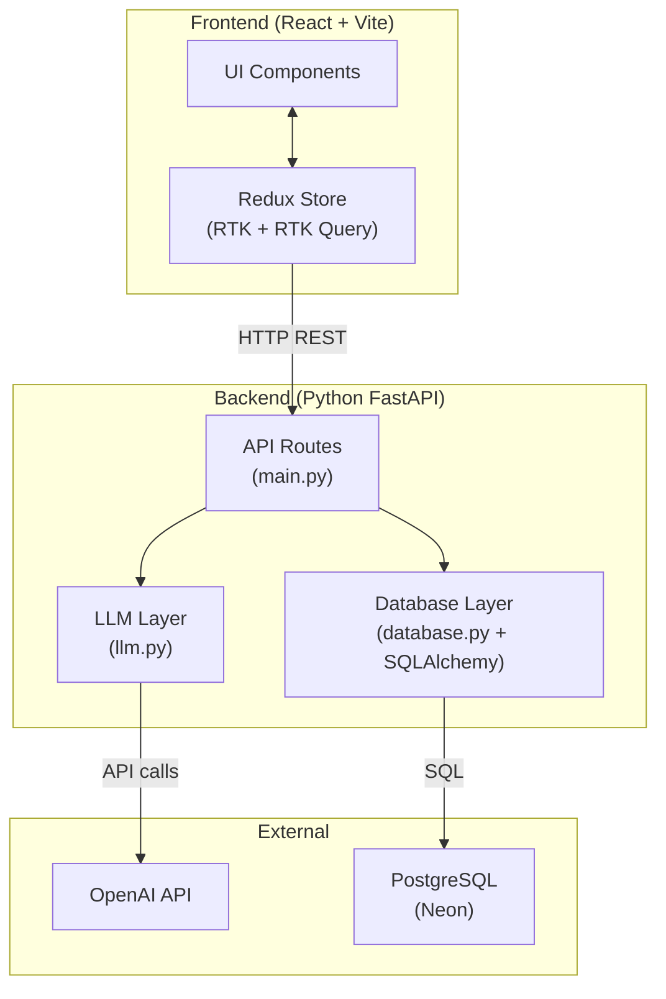
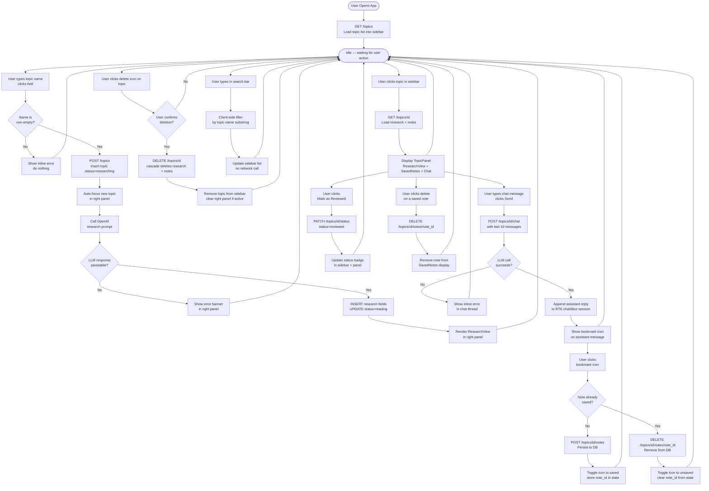
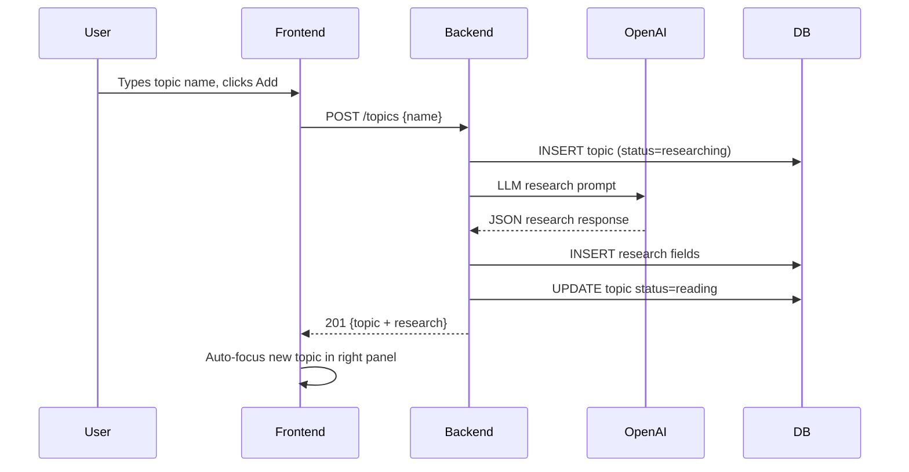

# Design Document: AI Knowledge Notebook

## Overview

The AI Knowledge Notebook is a full-stack web application with a React/Vite frontend and a Python FastAPI backend. Users add topics which trigger automatic LLM-powered research generation. The app supports persistent storage of research and notes in PostgreSQL, and ephemeral per-topic chat sessions held entirely in Redux client-side state.

The UI follows an email-app style: a fixed left sidebar lists topics with a search bar and add button, and a right panel displays the selected topic's research, saved notes, and chat thread.

---

## Architecture



---

## System Flowchart



---

### Request Flow — Add Topic



---

## Components and Interfaces

### Frontend Components

```
App
├── Sidebar
│   ├── SearchBar          — client-side filter input
│   ├── TopicList
│   │   └── TopicItem      — name, status badge, delete icon
│   └── AddTopicInput      — text input + add button
└── TopicPanel
    ├── PanelHeader        — topic name, status badge, Mark as Reviewed button
    ├── ResearchView       — renders 7 research fields, no delete
    ├── SavedNotes
    │   └── NoteItem       — note content + delete icon
    ├── ChatThread
    │   └── ChatMessage    — message bubble + bookmark icon (assistant only)
    └── ChatInput          — text input + send button
```

### Redux Store Shape

```js
{
  // RTK Query cache — server state
  api: {
    queries: {
      "getTopics": { data: [{id, name, status}] },
      "getTopic(id)": { data: {id, name, status, research, notes} }
    }
  },

  // topicsSlice — UI state
  topics: {
    searchQuery: string,
    activeTopic Id: string | null
  },

  // chatSlice — ephemeral per-topic sessions
  chat: {
    sessions: {
      [topicId]: [
        { role: "user"|"assistant", content: string }
      ]
    }
  }
}
```

### RTK Query API Service (`services/api.js`)

| Endpoint tag         | Method | URL                              |
|----------------------|--------|----------------------------------|
| `getTopics`          | GET    | `/topics`                        |
| `getTopic`           | GET    | `/topics/{id}`                   |
| `createTopic`        | POST   | `/topics`                        |
| `updateTopicStatus`  | PATCH  | `/topics/{id}/status`            |
| `deleteTopic`        | DELETE | `/topics/{id}`                   |
| `sendChatMessage`    | POST   | `/topics/{id}/chat`              |
| `saveNote`           | POST   | `/topics/{id}/notes`             |
| `deleteNote`         | DELETE | `/topics/{id}/notes/{note_id}`   |

Cache invalidation:
- `createTopic` → invalidates `getTopics`, `getTopic(id)`
- `deleteTopic` → invalidates `getTopics`
- `saveNote` / `deleteNote` → invalidates `getTopic(id)`
- `updateTopicStatus` → invalidates `getTopics`, `getTopic(id)`

---

## Data Models

### PostgreSQL Schema

```sql
CREATE TABLE topics (
    id          UUID        PRIMARY KEY DEFAULT gen_random_uuid(),
    name        TEXT        NOT NULL,
    status      TEXT        NOT NULL DEFAULT 'researching',
    created_at  TIMESTAMP   NOT NULL DEFAULT NOW()
);

CREATE TABLE research (
    id          UUID        PRIMARY KEY DEFAULT gen_random_uuid(),
    topic_id    UUID        NOT NULL REFERENCES topics(id) ON DELETE CASCADE,
    one_liner   TEXT,
    mechanism   TEXT,
    when_to_use TEXT,
    tradeoffs   TEXT,
    interview   TEXT,
    related     TEXT,
    diagram     TEXT
);

CREATE TABLE saved_notes (
    id          UUID        PRIMARY KEY DEFAULT gen_random_uuid(),
    topic_id    UUID        NOT NULL REFERENCES topics(id) ON DELETE CASCADE,
    content     TEXT        NOT NULL,
    created_at  TIMESTAMP   NOT NULL DEFAULT NOW()
);
```

Both `research` and `saved_notes` use `ON DELETE CASCADE` so deleting a topic automatically removes all child rows.

### SQLAlchemy Models (`database.py`)

```python
class Topic(Base):
    __tablename__ = "topics"
    id         = Column(UUID(as_uuid=True), primary_key=True, default=uuid4)
    name       = Column(Text, nullable=False)
    status     = Column(Text, nullable=False, default="researching")
    created_at = Column(DateTime, default=datetime.utcnow)
    research   = relationship("Research", back_populates="topic",
                              cascade="all, delete-orphan", uselist=False)
    notes      = relationship("SavedNote", back_populates="topic",
                              cascade="all, delete-orphan")

class Research(Base):
    __tablename__ = "research"
    id          = Column(UUID(as_uuid=True), primary_key=True, default=uuid4)
    topic_id    = Column(UUID(as_uuid=True), ForeignKey("topics.id"), nullable=False)
    one_liner   = Column(Text)
    mechanism   = Column(Text)
    when_to_use = Column(Text)
    tradeoffs   = Column(Text)
    interview   = Column(Text)
    related     = Column(Text)
    diagram     = Column(Text)
    topic       = relationship("Topic", back_populates="research")

class SavedNote(Base):
    __tablename__ = "saved_notes"
    id         = Column(UUID(as_uuid=True), primary_key=True, default=uuid4)
    topic_id   = Column(UUID(as_uuid=True), ForeignKey("topics.id"), nullable=False)
    content    = Column(Text, nullable=False)
    created_at = Column(DateTime, default=datetime.utcnow)
    topic      = relationship("Topic", back_populates="notes")
```

### API Response Shapes

**Topic list item** (`GET /topics`):
```json
{ "id": "uuid", "name": "string", "status": "researching|reading|reviewed", "created_at": "iso8601" }
```

**Full topic** (`GET /topics/{id}`):
```json
{
  "id": "uuid", "name": "string", "status": "string", "created_at": "iso8601",
  "research": {
    "one_liner": "", "mechanism": "", "when_to_use": "",
    "tradeoffs": "", "interview": "", "related": "", "diagram": ""
  },
  "notes": [{ "id": "uuid", "content": "string", "created_at": "iso8601" }]
}
```

**Chat response** (`POST /topics/{id}/chat`):
```json
{ "reply": "string" }
```

---

## LLM Integration (`llm.py`)

The LLM client uses the OpenAI Python SDK pointed at Azure AI inference. The client is initialized once at module load using environment variables.

```python
import os
from openai import OpenAI
from dotenv import load_dotenv

load_dotenv()

client = OpenAI(
    api_key=os.getenv("OPENAI_API_KEY"),
    base_url="https://models.inference.ai.azure.com"
)
MODEL = "gpt-4o"
```

### Research Prompt

```
System: You are a subject matter expert. Always respond in valid JSON only.

User: Research the following topic and return a JSON object with exactly these keys:
Topic: {topic_name}
{
  "one_liner": "plain English explanation",
  "mechanism": "how it works internally",
  "when_to_use": "real-world scenarios",
  "tradeoffs": "Pros:\n- ...\nCons:\n- ...",
  "interview": "2-3 crisp sentences",
  "related": "comma separated related concepts",
  "diagram": "ASCII diagram or empty string"
}
```

Parsing strategy: call `json.loads()` on the response content. If parsing fails, catch the exception, log it, and raise an HTTP 500 to the caller (which the frontend surfaces as an error state).

### Chat Prompt

```
System: You are a knowledgeable tutor. The user is learning about "{topic_name}".
        Answer what is asked concisely.

Messages: [last 10 messages from the frontend payload]
```

### Token Budget

| Segment                  | ~Tokens |
|--------------------------|---------|
| System prompt + topic    | 100     |
| Last 10 session messages | 2,000   |
| Response buffer          | 1,900   |
| Total                    | ~4,000  |

---

## Correctness Properties

*A property is a characteristic or behavior that should hold true across all valid executions of a system — essentially, a formal statement about what the system should do. Properties serve as the bridge between human-readable specifications and machine-verifiable correctness guarantees.*

### Property 1: Research field completeness

*For any* topic name submitted to `POST /topics`, the research record stored in the database SHALL contain all seven fields (`one_liner`, `mechanism`, `when_to_use`, `tradeoffs`, `interview`, `related`, `diagram`) as non-null values (`diagram` may be an empty string but not null), and the topic's `id` SHALL be a valid UUID v4.

**Validates: Requirements 1.6, 2.1, 10.2**

---

### Property 2: Status lifecycle monotonicity

*For any* topic, the sequence of status transitions SHALL only move forward: `researching → reading → reviewed`. A topic SHALL NOT transition backwards, and any PATCH request attempting to set an invalid status value SHALL be rejected. A newly created topic SHALL always have status `researching`.

**Validates: Requirements 1.1, 3.1, 3.2, 3.3, 3.4**

---

### Property 3: Cascade delete completeness

*For any* topic with any number of saved notes, after `DELETE /topics/{id}` completes, subsequent database queries for that topic's research record or any of its saved notes SHALL return zero rows.

**Validates: Requirements 8.3, 8.4, 10.3, 10.4**

---

### Property 4: Note save and delete round-trip

*For any* chat message content string, saving it via `POST /topics/{id}/notes` and then fetching `GET /topics/{id}` SHALL include a note whose `content` equals the original string. Subsequently deleting that note via `DELETE /topics/{id}/notes/{note_id}` and fetching `GET /topics/{id}` again SHALL return a notes array that does not contain that note ID.

**Validates: Requirements 5.2, 5.3, 6.1, 6.3**

---

### Property 5: Search filter correctness and invertibility

*For any* non-empty search query string and any list of loaded topics, the filtered result set SHALL contain exactly those topics whose names contain the query string (case-insensitive) and no others. When the search query is cleared (empty string), the result set SHALL equal the original unfiltered topic list.

**Validates: Requirements 7.2, 7.3**

---

### Property 6: Empty topic name rejection

*For any* string composed entirely of whitespace characters (including the empty string), submitting it as a topic name SHALL result in an HTTP 422 response, no new topic record in the database, and the topic list length remaining unchanged.

**Validates: Requirements 1.4**

---

### Property 7: Chat session isolation and preservation

*For any* two distinct topic IDs A and B, messages appended to topic A's chat session SHALL NOT appear in topic B's session. Furthermore, after switching from topic A to topic B and back to topic A, topic A's session SHALL contain the same messages as before the switch.

**Validates: Requirements 4.1, 4.4**

---

### Property 8: Research JSON parse round-trip

*For any* dictionary of research field values (all seven keys with arbitrary string values), serializing to JSON and parsing back using the research parsing function SHALL produce a dictionary equal to the original.

**Validates: Requirements 2.2**

---

### Property 9: Chat context window enforcement

*For any* chat session with more than 10 messages, the payload sent to `POST /topics/{id}/chat` SHALL contain at most the last 10 messages from that session, regardless of the total session length.

**Validates: Requirements 4.2, 4.3**

---

### Property 10: Saved notes ordering invariant

*For any* set of saved notes for a topic inserted in a known order, `GET /topics/{id}` SHALL return those notes sorted by `created_at` ascending, regardless of insertion order variability.

**Validates: Requirements 6.4**

---

### Property 11: Missing resource returns 404

*For any* UUID that does not correspond to an existing topic, any API endpoint that accepts a topic `{id}` path parameter SHALL return HTTP 404.

**Validates: Requirements 9.9**

---

## Error Handling

| Scenario | Backend Behavior | Frontend Behavior |
|---|---|---|
| LLM returns unparseable JSON | Return HTTP 500 with `{"detail": "Research generation failed"}` | Show error banner in right panel; topic status stays `researching` |
| LLM chat call fails | Return HTTP 500 with `{"detail": "Chat failed"}` | Show inline error message in chat thread |
| Topic not found | Return HTTP 404 | Show "Topic not found" in right panel |
| DB connection failure | Return HTTP 500 | Show generic error banner |
| Empty topic name submitted | Return HTTP 422 | Disable add button / show inline validation |
| Note save fails | Return HTTP 500 | Revert bookmark icon to unsaved state |

---

## Testing Strategy

### Unit Tests

- Backend route handlers: test each endpoint with mock DB sessions and mock LLM responses.
- LLM prompt construction: verify the research and chat prompts are built correctly for given inputs.
- JSON parsing: verify that valid LLM JSON is correctly mapped to research fields, and that invalid JSON raises the expected exception.
- Frontend utility functions: test client-side search filter logic and status transition guards.

### Property-Based Tests

Property-based tests use [Hypothesis](https://hypothesis.readthedocs.io/) on the backend and [fast-check](https://fast-check.io/) on the frontend. Each test runs a minimum of 100 iterations.

| Property | Test approach |
|---|---|
| Property 1: Research field completeness | Generate random topic name strings; call research parsing function; assert all 7 keys present, non-null, and id is valid UUID |
| Property 2: Status lifecycle monotonicity | Generate random valid/invalid status transition sequences; assert only forward transitions accepted; newly created topics have status=researching |
| Property 3: Cascade delete completeness | Generate topics with random numbers of notes; insert into test DB; delete topic; assert zero child rows remain |
| Property 4: Note save and delete round-trip | Generate random note content strings; save; fetch; assert match; delete; fetch; assert absent |
| Property 5: Search filter correctness and invertibility | Generate random topic name lists and query strings; assert filter output matches case-insensitive substring predicate; clearing filter restores full list |
| Property 6: Empty topic name rejection | Generate strings of whitespace/empty chars; assert API returns 422 and topic count unchanged |
| Property 7: Chat session isolation and preservation | Generate random message sequences for pairs of topic IDs; switch topics; assert sessions independent and preserved |
| Property 8: Research JSON parse round-trip | Generate random research field values dicts; serialize to JSON; parse back; assert field equality |
| Property 9: Chat context window enforcement | Generate chat sessions of varying lengths > 10; assert payload to LLM contains at most 10 messages |
| Property 10: Saved notes ordering invariant | Generate note sets with known timestamps; assert GET response returns notes in ascending created_at order |
| Property 11: Missing resource returns 404 | Generate random UUIDs not in DB; call each endpoint with that ID; assert HTTP 404 |

**Test tag format**: `# Feature: ai-knowledge-notebook, Property {N}: {property_text}`

Each correctness property above is implemented by exactly one property-based test. Unit tests handle specific edge cases and integration points separately from property tests.
