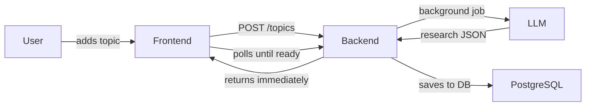

# AI Knowledge Notebook

A full-stack AI-powered notebook. Add a topic, get an instant structured research summary from an LLM, then chat with it, save notes, and organize everything into categories.

---

## How it works



The backend responds instantly — research generation runs in the background. The UI shows a spinner until the LLM job finishes, then automatically displays the results.

---

## Tech Stack

| Layer | Technology |
|-------|-----------|
| Frontend | React 18, Vite, Redux Toolkit, RTK Query, Tailwind CSS |
| Backend | Python, FastAPI, SQLAlchemy |
| Database | PostgreSQL |
| LLM | Any OpenAI-compatible API (Azure AI, OpenAI, Groq, Ollama) |
| Auth | JWT + Google OAuth + GitHub OAuth |

---

## Quick Start

**Prerequisites:** Python 3.10+, Node.js 18+, PostgreSQL

### Backend

```bash
cd backend
python -m venv venv && source venv/bin/activate
pip install -r requirements.txt
cp .env.example .env    # fill in DATABASE_URL, OPENAI_API_KEY, JWT_SECRET, etc.
uvicorn app.main:app --reload
```

Runs at `http://localhost:8000`. Interactive API docs at `/docs`.

### Frontend

```bash
cd frontend
npm install
# create .env with: VITE_API_BASE_URL=http://localhost:8000
npm run dev
```

Runs at `http://localhost:5173`.

### Docker

```bash
cd backend  && docker-compose up
cd frontend && docker-compose up
```

---

## Project Structure

```
├── backend/
│   ├── app/
│   │   ├── main.py          # App setup + router registration
│   │   ├── config.py        # All env vars
│   │   ├── database.py      # Engine, session, Base
│   │   ├── models/          # ORM models
│   │   ├── schemas/         # Pydantic request bodies
│   │   ├── routers/         # auth, topics, categories
│   │   ├── services/        # LLM client
│   │   └── core/            # JWT + security
│   └── BACKEND.md           # ← Full backend documentation
│
├── frontend/
│   ├── src/
│   │   ├── components/  # React components
│   │   ├── services/    # RTK Query API slice
│   │   ├── store/       # Redux slices
│   │   └── hooks/       # useTheme hook│   └── FRONTEND.md      # ← Full frontend documentation
│
└── README.md
```

---

## Documentation

| Doc | Contents |
|-----|----------|
| [`backend/BACKEND.md`](backend/BACKEND.md) | DB schema, all API endpoints, auth flow, LLM integration, env vars, performance notes |
| [`frontend/FRONTEND.md`](frontend/FRONTEND.md) | Component tree, state management, cache strategy, polling, theme system, feature checklist |

---

## Features

- **Hierarchical topics** — organize topics into categories (VS Code-style sidebar)
- **AI research** — instant structured summaries: explanation, mechanism, tradeoffs, interview tips, ASCII diagram
- **Chat** — follow-up Q&A scoped to the topic
- **Saved notes** — bookmark any AI reply as a persistent note
- **Status tracking** — researching → reading → reviewed
- **Dark / light theme**
- **OAuth** — Google and GitHub sign-in

---
