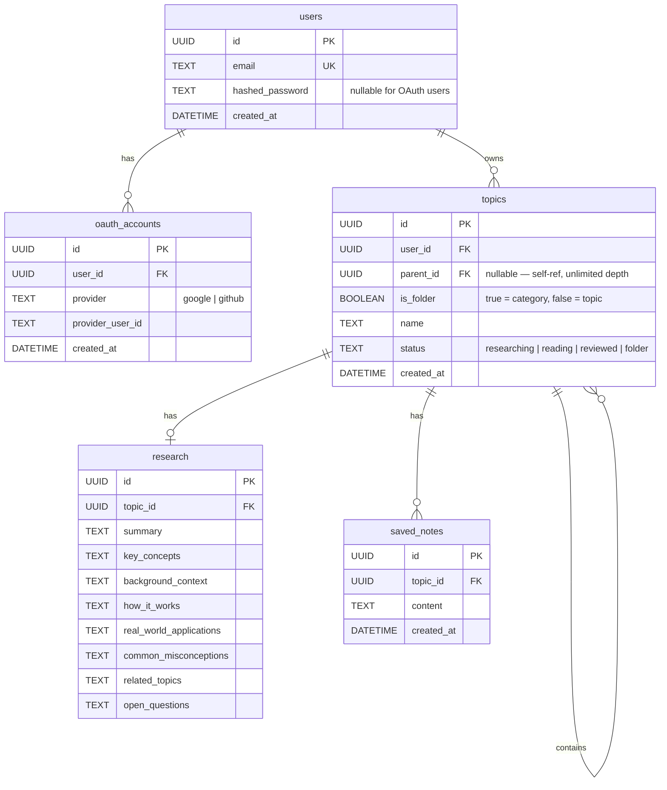
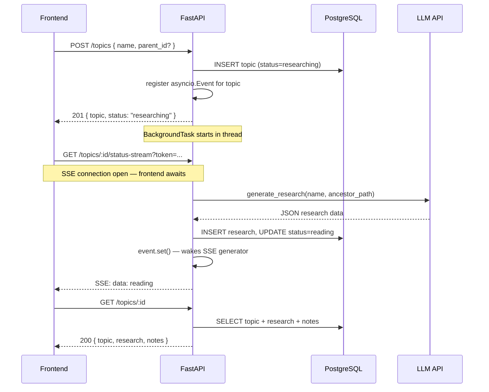
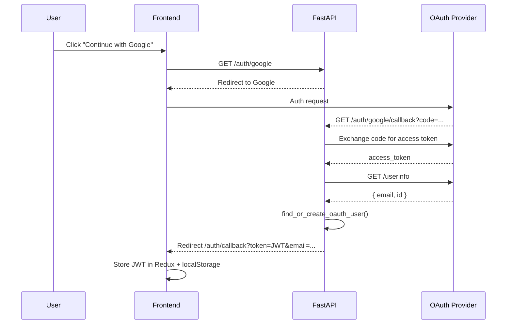

# Backend Documentation

> Python · FastAPI · SQLAlchemy · PostgreSQL · OpenAI-compatible LLM

---

## Architecture Overview

```mermaid
graph TD
    Client["React Frontend"]

    subgraph FastAPI["FastAPI Application (main.py)"]
        Auth["Auth Routes\n/auth/*"]
        Topics["Topic Routes\n/topics/*"]
        Categories["Category Routes\n/main-topics/*"]
        Tree["Topic Tree\nGET /topic-tree"]
        SSE["SSE Stream\nGET /topics/:id/status-stream"]
        Chat["Chat\nPOST /topics/:id/chat"]
        Notes["Notes\n/topics/:id/notes/*"]
    end

    subgraph Background["Background Tasks"]
        Research["LLM Research\ngenerate_research()"]
        EventSignal["asyncio.Event\n(per topic)"]
    end

    subgraph DB["PostgreSQL (via SQLAlchemy)"]
        Users["users"]
        TopicsTable["topics\n(folders + topics, unlimited depth)"]
        ResearchTable["research"]
        NotesTable["saved_notes"]
        OAuth["oauth_accounts"]
    end

    subgraph LLM["LLM Provider (OpenAI-compatible)"]
        LLMApi["gpt-4o / Azure / Groq / Ollama"]
    end

    Client -->|JWT Bearer| Auth
    Client -->|JWT Bearer| Topics
    Client -->|JWT Bearer| Categories
    Client -->|JWT Bearer| Tree
    Client -->|token query param| SSE
    Client -->|JWT Bearer| Chat
    Client -->|JWT Bearer| Notes

    Auth --> Users
    Auth --> OAuth
    Topics --> TopicsTable
    Categories --> TopicsTable
    Tree --> TopicsTable
    Chat --> LLMApi
    Notes --> NotesTable
    Topics -->|BackgroundTask| Research
    Research --> LLMApi
    Research --> ResearchTable
    Research -->|event.set()| EventSignal
    EventSignal -->|wakes| SSE
    TopicsTable --> ResearchTable
    TopicsTable --> NotesTable
```

---

## Project Structure

```
backend/
├── app/
│   ├── main.py              # FastAPI app setup + router registration
│   ├── config.py            # All env vars in one place
│   ├── database.py          # Engine, SessionLocal, Base, get_db
│   ├── models/
│   │   └── models.py        # ORM models (User, Topic, Research, SavedNote, OAuthAccount)
│   ├── schemas/
│   │   └── schemas.py       # Pydantic request bodies
│   ├── routers/
│   │   ├── auth.py          # /auth/* routes
│   │   ├── topics.py        # /topics/* routes + serialisation + SSE + background job
│   │   └── categories.py    # /main-topics/* + /topic-tree routes
│   ├── services/
│   │   └── llm.py           # LLM client (research + chat), context-aware prompts
│   └── core/
│       ├── security.py      # JWT, hashing, OAuth user management
│       └── limiter.py       # slowapi rate limiter, keyed by user ID
├── .env
├── .env.example
├── requirements.txt
├── Dockerfile
└── docker-compose.yml
```

---

## Data Models



### Key design decisions

- **Single `topics` table** — categories (folders) and research topics share the same table. `is_folder=true` marks a category; `parent_id` links to the parent at any depth.
- **Self-referential FK** — `topics.parent_id → topics.id` with `ON DELETE CASCADE`. Deleting a folder cascades to all descendants automatically.
- **Unlimited nesting** — the model supports arbitrary depth. Serialisation is recursive via `_serialize_main_topic`.
- **Portable UUID** — custom `PortableUUID` TypeDecorator works with PostgreSQL (native UUID) and SQLite (CHAR36).
- **DB indexes** — `ix_topics_user_id`, `ix_topics_parent_id`, `ix_saved_notes_topic_id` created at startup.

---

## API Reference

### Auth

| Method | Path | Description |
|--------|------|-------------|
| `GET` | `/auth/status` | Check if registration is open |
| `POST` | `/auth/register` | Register with email + password |
| `POST` | `/auth/login` | Login, returns JWT |
| `POST` | `/auth/forgot-password` | Generate reset link (returned in response) |
| `POST` | `/auth/reset-password` | Reset password using token |
| `GET` | `/auth/me` | Current user info |
| `GET` | `/auth/google` | Start Google OAuth |
| `GET` | `/auth/google/callback` | Google OAuth callback |
| `GET` | `/auth/github` | Start GitHub OAuth |
| `GET` | `/auth/github/callback` | GitHub OAuth callback |

> **Password Reset** — `POST /auth/forgot-password` returns `reset_link` in JSON. No email is sent. Token expires in 10 minutes.

### Categories (folders)

| Method | Path | Description |
|--------|------|-------------|
| `POST` | `/main-topics` | Create a folder (pass `parent_id` for subfolder) |
| `DELETE` | `/main-topics/:id` | Delete folder + all descendants (cascade) |
| `PATCH` | `/main-topics/:id/name` | Rename folder |
| `GET` | `/topic-tree` | Full recursive hierarchy for current user |

### Topics

| Method | Path | Description |
|--------|------|-------------|
| `POST` | `/topics` | Create topic, triggers background research |
| `GET` | `/topics` | List all topics (flat) |
| `GET` | `/topics/:id` | Get topic with research + notes |
| `PATCH` | `/topics/:id/status` | Update status |
| `PATCH` | `/topics/:id/name` | Rename topic |
| `PATCH` | `/topics/:id/research` | Edit one or more research fields |
| `DELETE` | `/topics/:id` | Delete topic + research + notes |
| `POST` | `/topics/:id/retry` | Re-trigger research generation |
| `GET` | `/topics/:id/status-stream` | SSE stream — fires once when research completes |
| `POST` | `/topics/:id/chat` | Send chat message, get LLM reply |
| `POST` | `/topics/:id/notes` | Save a note |
| `PATCH` | `/topics/:id/notes/:note_id` | Update a note |
| `DELETE` | `/topics/:id/notes/:note_id` | Delete a note |

### Topic Tree response shape

```json
{
  "nodes": [
    {
      "id": "uuid",
      "name": "System Design",
      "is_folder": true,
      "created_at": "iso8601",
      "children": [
        {
          "id": "uuid",
          "name": "Scaling",
          "is_folder": true,
          "created_at": "iso8601",
          "children": [
            { "id": "uuid", "name": "Horizontal Scaling", "is_folder": false, "status": "reading", "created_at": "iso8601" },
            { "id": "uuid", "name": "Vertical Scaling", "is_folder": false, "status": "researching", "created_at": "iso8601" }
          ]
        }
      ]
    },
    { "id": "uuid", "name": "Root topic", "is_folder": false, "status": "reviewed", "created_at": "iso8601" }
  ]
}
```

`nodes` is a flat list of root-level items (folders and topics). Each folder has a `children` array which can contain more folders or topics at any depth.

`GET /topic-tree` uses HTTP ETags — returns `304 Not Modified` when the tree hasn't changed.

---

## Request / Response Flow



---

## SSE Push Notification

Instead of client-side polling, the backend uses `asyncio.Event` per topic:

1. `POST /topics` registers an `asyncio.Event` in `_research_events[topic_id]`
2. `GET /topics/:id/status-stream` awaits the event — no DB queries while waiting
3. The background thread calls `loop.call_soon_threadsafe(event.set)` when research finishes
4. The SSE generator wakes, opens one fresh DB session to read the final status, sends it, closes

This means **zero DB polling** during research. The only DB call in the SSE path is one `SELECT` at the end.

`EventSource` doesn't support custom headers so the JWT is passed as a `?token=` query parameter.

---

## Context-Aware LLM Prompts

The LLM receives the full ancestor folder path so it can scope answers correctly:

```
Topic: Horizontal Scaling
Category/Domain: System Design > Scaling
```

This prevents ambiguous answers when the same term appears in different domains (e.g. "Consistency" in distributed systems vs. psychology).

The ancestor path is built by walking `parent_id` links up the tree at research time and at chat time.

---

## Authentication Flow



---

## LLM Integration

Provider-agnostic via the OpenAI-compatible API. Change provider via `.env` — no code changes needed.

```
LLM_MODEL=gpt-4o
LLM_BASE_URL=https://models.inference.ai.azure.com
OPENAI_API_KEY=your_key
```

**Research** — single non-streaming call. Returns 8 fields: `summary`, `key_concepts`, `background_context`, `how_it_works`, `real_world_applications`, `common_misconceptions`, `related_topics`, `open_questions`.

**Chat** — stateless per request. Last 10 messages sent as `history`. System prompt includes topic name and ancestor path.

---

## Environment Variables

| Variable | Required | Description |
|----------|----------|-------------|
| `DATABASE_URL` | Yes | PostgreSQL connection string |
| `OPENAI_API_KEY` | Yes | API key for LLM provider |
| `LLM_MODEL` | Yes | Model name e.g. `gpt-4o` |
| `LLM_BASE_URL` | Yes | LLM provider base URL |
| `JWT_SECRET` | Yes | Secret for signing JWTs |
| `FRONTEND_URL` | Yes | Allowed CORS origin |
| `BACKEND_URL` | Yes | Used in OAuth redirect URIs |
| `GOOGLE_CLIENT_ID` | Optional | Google OAuth |
| `GOOGLE_CLIENT_SECRET` | Optional | Google OAuth |
| `GITHUB_CLIENT_ID` | Optional | GitHub OAuth |
| `GITHUB_CLIENT_SECRET` | Optional | GitHub OAuth |
| `REGISTRATION_OPEN` | Optional | `true`/`false`, default `true` |

---

## Local Setup

```bash
cd backend
python -m venv venv
source venv/bin/activate
pip install -r requirements.txt
cp .env.example .env
uvicorn app.main:app --reload   # http://localhost:8000/docs
```

---

## Performance Notes

- **No client polling** — SSE push replaces all polling during research generation.
- **asyncio.Event** — SSE waits with zero CPU/DB usage; woken by a thread-safe signal.
- **Selective joinedload** — `_owned_topic` skips `research`/`notes` joins for rename, status update, and delete (pass `load_relations=False`).
- **Recursive serialisation** — `_serialize_main_topic` handles unlimited folder depth in one pass.
- **ETag caching** — `/topic-tree` returns `304` when unchanged (MD5 of payload).
- **Connection pooling** — `pool_size=5`, `max_overflow=10`, `pool_pre_ping=True`, `pool_recycle=300`.
- **Async OAuth** — Google/GitHub callbacks use `httpx.AsyncClient`.
- **LLM timeout** — 30s timeout on all LLM calls.

---

## Rate Limiting

| Route | Limit |
|-------|-------|
| `POST /topics` | 5 / minute |
| `POST /topics/:id/retry` | 3 / minute |
| `POST /topics/:id/chat` | 10 / minute |

Keyed by JWT user ID via `slowapi`. Returns `429 Too Many Requests` when exceeded.
