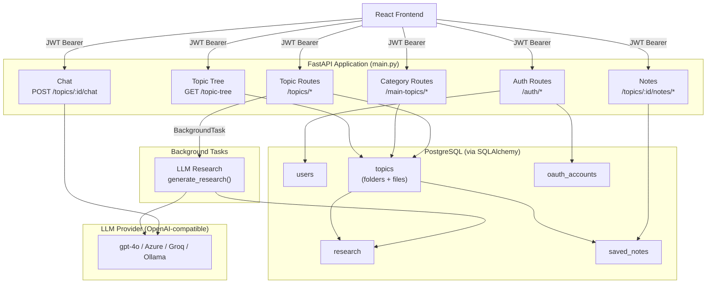
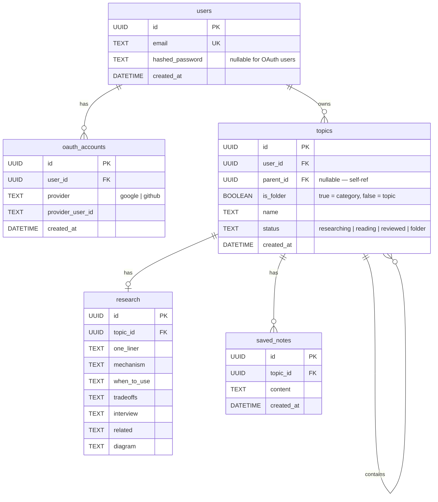
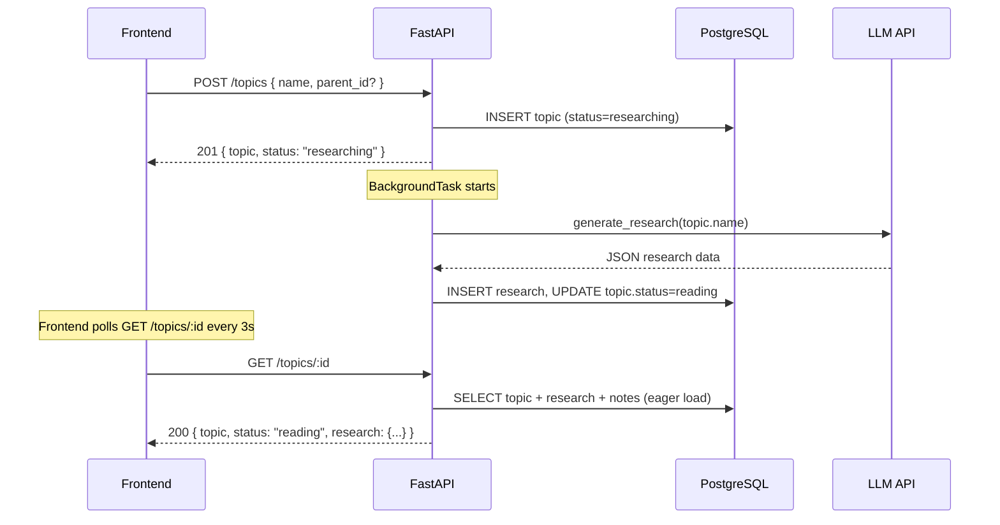
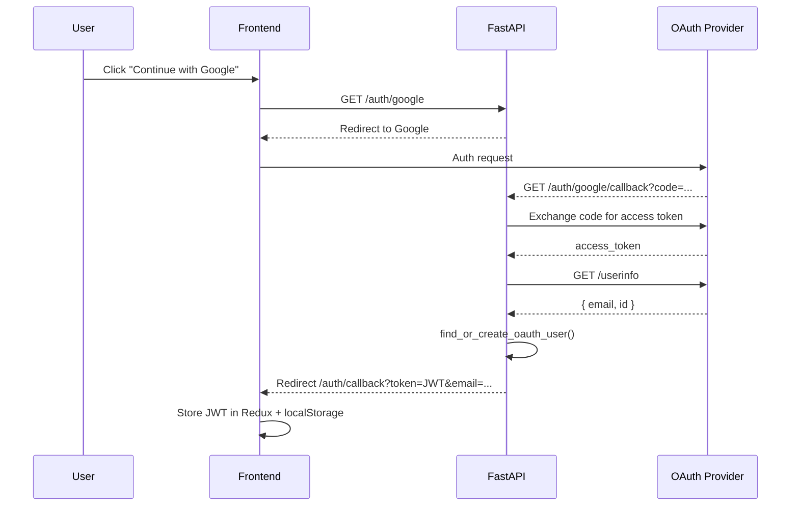

# Backend Documentation

> Python · FastAPI · SQLAlchemy · PostgreSQL · OpenAI-compatible LLM

---

## Architecture Overview



---

## Project Structure

```
backend/
├── app/
│   ├── main.py              # FastAPI app setup + router registration
│   ├── config.py            # All env vars in one place
│   ├── database.py          # Engine, SessionLocal, Base, get_db
│   ├── models/
│   │   └── models.py        # ORM models (User, Topic, Research, SavedNote)
│   ├── schemas/
│   │   └── schemas.py       # Pydantic request bodies
│   ├── routers/
│   │   ├── auth.py          # /auth/* routes
│   │   ├── topics.py        # /topics/* routes + serialisation helpers
│   │   └── categories.py    # /main-topics/* + /topic-tree routes
│   ├── services/
│   │   └── llm.py           # LLM client (research + chat)
│   └── core/
│       └── security.py      # JWT, hashing, OAuth user management
├── .env
├── .env.example
├── requirements.txt
├── Dockerfile
└── docker-compose.yml
```

Run locally: `uvicorn app.main:app --reload`

---

## Data Models



### Key design decisions

- **Single `topics` table** — categories (folders) and research topics (files) share the same table. `is_folder=true` marks a category; `parent_id` links topics to their category.
- **Self-referential FK** — `topics.parent_id → topics.id` with `ON DELETE CASCADE`, so deleting a category cascades to all its topics automatically.
- **Portable UUID type** — custom `PortableUUID` TypeDecorator works with both PostgreSQL (native UUID) and SQLite (CHAR36), making local dev and tests easy.
- **DB indexes** — `ix_topics_user_id`, `ix_topics_parent_id`, `ix_saved_notes_topic_id` created at startup for fast per-user queries.

---

## API Reference

### Auth

| Method | Path | Description |
|--------|------|-------------|
| `GET` | `/auth/status` | Check if registration is open (public) |
| `POST` | `/auth/register` | Register with email + password |
| `POST` | `/auth/login` | Login, returns JWT |
| `POST` | `/auth/forgot-password` | Generate reset link (returned in response body) |
| `POST` | `/auth/reset-password` | Reset password using token |
| `GET` | `/auth/me` | Current user info |
| `GET` | `/auth/google` | Start Google OAuth flow |
| `GET` | `/auth/google/callback` | Google OAuth callback |
| `GET` | `/auth/github` | Start GitHub OAuth flow |
| `GET` | `/auth/github/callback` | GitHub OAuth callback |

All routes except `/auth/status`, `/auth/register`, `/auth/login`, `/auth/forgot-password`, `/auth/reset-password`, `/auth/google`, `/auth/github`, and their callbacks require a `Bearer <jwt>` header.

> **Password Reset** — `POST /auth/forgot-password` returns a `reset_link` directly in the JSON response. No email is sent. The frontend displays the link as a clickable URL. The token embedded in the link expires in **10 minutes**.

### Categories (main topics / folders)

| Method | Path | Description |
|--------|------|-------------|
| `POST` | `/main-topics` | Create a category |
| `DELETE` | `/main-topics/:id` | Delete category + all its topics (cascade) |
| `PATCH` | `/main-topics/:id/name` | Rename a category |
| `GET` | `/topic-tree` | Full hierarchy for current user |

### Topics (files)

| Method | Path | Description |
|--------|------|-------------|
| `POST` | `/topics` | Create topic, triggers background research |
| `GET` | `/topics` | List all topics (flat) |
| `GET` | `/topics/:id` | Get single topic with research + notes |
| `PATCH` | `/topics/:id/status` | Update status (`researching/reading/reviewed`) |
| `PATCH` | `/topics/:id/name` | Rename topic |
| `DELETE` | `/topics/:id` | Delete topic + research + notes |
| `POST` | `/topics/:id/retry` | Re-trigger research generation |
| `POST` | `/topics/:id/chat` | Send chat message, get LLM reply |
| `POST` | `/topics/:id/notes` | Save a note |
| `DELETE` | `/topics/:id/notes/:note_id` | Delete a note |

### Topic Tree response shape

```json
{
  "main_topics": [
    {
      "id": "uuid",
      "name": "Scaling",
      "created_at": "iso8601",
      "sub_topics": [
        { "id": "uuid", "name": "Horizontal Scaling", "status": "reading", "created_at": "iso8601" }
      ]
    }
  ],
  "root_topics": [
    { "id": "uuid", "name": "Legacy flat topic", "status": "reviewed", "created_at": "iso8601" }
  ]
}
```

`root_topics` holds topics that have no parent category (backward-compatible with data created before the hierarchy feature).

The `GET /topic-tree` endpoint uses HTTP ETags — if the tree hasn't changed, the server returns `304 Not Modified` with no body.

---

## Request / Response Flow



---

## Authentication Flow



---

## LLM Integration

The LLM client is fully provider-agnostic via the OpenAI-compatible API standard. Change the provider by editing `.env` — no code changes needed.

```
LLM_MODEL=gpt-4o
LLM_BASE_URL=https://models.inference.ai.azure.com   # swap for Groq, Ollama, OpenAI, etc.
OPENAI_API_KEY=your_key
```

**Research generation** — single non-streaming call, returns structured JSON with 7 fields: `one_liner`, `mechanism`, `when_to_use`, `tradeoffs`, `interview`, `related`, `diagram`.

**Chat** — stateless per request. The frontend sends the last 10 messages as `history`. The backend prepends a system prompt scoped to the topic name.

---

## Environment Variables

Copy `.env.example` to `.env` and fill in:

| Variable | Required | Description |
|----------|----------|-------------|
| `DATABASE_URL` | Yes | PostgreSQL connection string |
| `OPENAI_API_KEY` | Yes | API key for LLM provider |
| `LLM_MODEL` | Yes | Model name e.g. `gpt-4o` |
| `LLM_BASE_URL` | Yes | LLM provider base URL |
| `JWT_SECRET` | Yes | Secret for signing JWTs |
| `FRONTEND_URL` | Yes | Allowed CORS origin |
| `BACKEND_URL` | Yes | Used in OAuth redirect URIs |
| `GOOGLE_CLIENT_ID` | Optional | For Google OAuth |
| `GOOGLE_CLIENT_SECRET` | Optional | For Google OAuth |
| `GITHUB_CLIENT_ID` | Optional | For GitHub OAuth |
| `GITHUB_CLIENT_SECRET` | Optional | For GitHub OAuth |
| `REGISTRATION_OPEN` | Optional | `true`/`false`, default `true` |

---

## Local Setup

```bash
cd backend
python -m venv venv
source venv/bin/activate        # Windows: venv\Scripts\activate
pip install -r requirements.txt
cp .env.example .env            # fill in your values
uvicorn app.main:app --reload   # http://localhost:8000
```

Interactive docs available at `http://localhost:8000/docs`.

---

## Performance Notes

- **N+1 eliminated** — `GET /topic-tree` uses `subqueryload(Topic.children)`; `GET /topics/:id` uses `joinedload(research, notes)`.
- **Background tasks** — research generation runs after the HTTP response is sent, so `POST /topics` returns in ~50ms.
- **ETag caching** — `/topic-tree` computes an MD5 of the serialised payload and returns `304` when unchanged.
- **Connection pooling** — `pool_size=5`, `max_overflow=10`, `pool_pre_ping=True`, `pool_recycle=300`.
- **Async OAuth** — Google and GitHub OAuth callbacks use `httpx.AsyncClient` (non-blocking).
- **LLM timeout** — all LLM calls have a 30-second timeout to prevent hanging background threads.

---

## Rate Limiting

LLM-heavy routes are rate limited per authenticated user (keyed by JWT user ID — tamper-proof).

| Route | Limit |
|-------|-------|
| `POST /topics` | 5 / minute |
| `POST /topics/:id/retry` | 3 / minute |
| `POST /topics/:id/chat` | 10 / minute |

Exceeding the limit returns `429 Too Many Requests`.

Rate limiting is implemented with `slowapi`. The key function reads `request.state.current_user.id` set by the `get_current_user` dependency — falls back to IP for unauthenticated routes.
