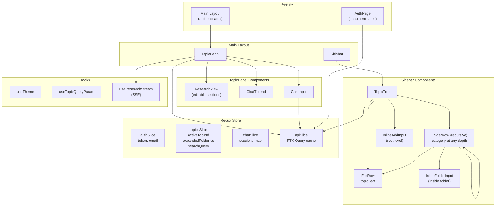
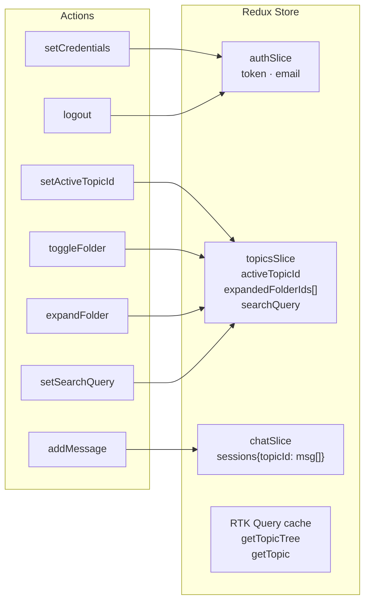
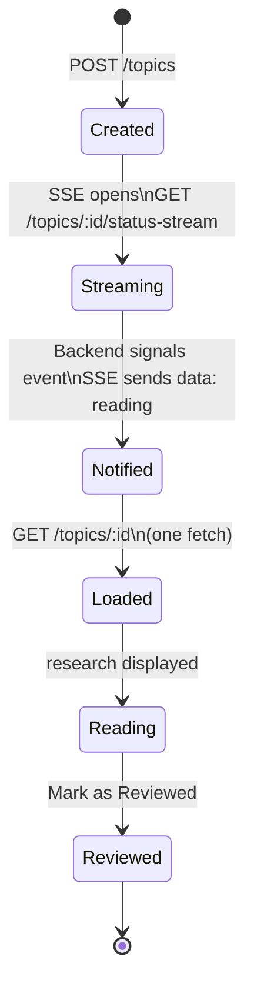
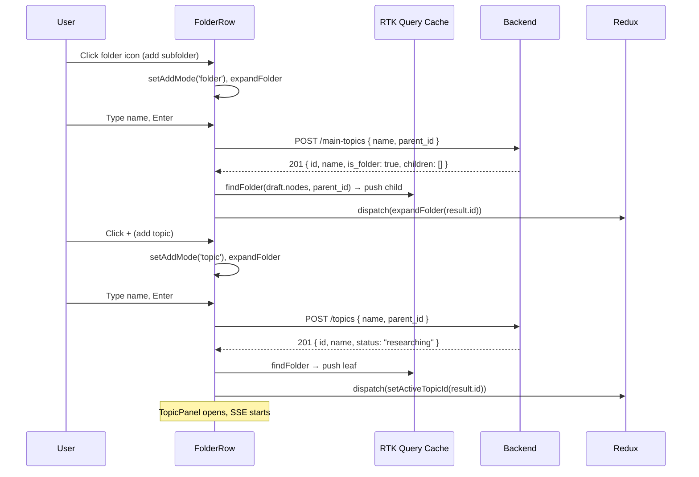
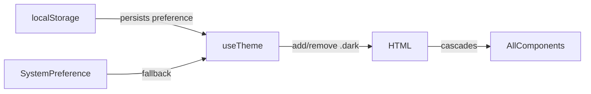

# Frontend Documentation

> React 18 · Vite · Redux Toolkit · RTK Query · Tailwind CSS

---

## Architecture Overview



---

## Project Structure

```
frontend/src/
├── App.jsx                      # Root — auth gate, layout split
├── main.jsx                     # React + Redux provider mount
├── index.css                    # Tailwind directives
│
├── components/
│   ├── AuthPage.jsx             # Login / register / OAuth
│   ├── AuthCallback.jsx         # OAuth redirect handler
│   ├── Sidebar.jsx              # Left panel shell + header actions
│   ├── TopicTree.jsx            # Tree list — renders root nodes recursively
│   ├── FolderRow.jsx            # Recursive folder row (expand/collapse/add/rename/delete)
│   ├── FileRow.jsx              # Topic leaf row (select/rename/delete/retry)
│   ├── TopicPanel.jsx           # Right panel — research + chat
│   ├── ResearchView.jsx         # 8-field editable research display
│   ├── ChatThread.jsx           # Message list with bookmark/edit
│   ├── ChatInput.jsx            # Textarea + send button
│   ├── RichEditor.jsx           # TipTap rich text editor (note editing)
│   └── shared/
│       ├── StatusBadge.jsx      # researching / reading / reviewed pill
│       └── ConfirmDialog.jsx    # Modal replacing window.confirm
│
├── hooks/
│   ├── useTheme.js              # Dark/light — reads/writes localStorage + system pref
│   ├── useTopicQueryParam.js    # Syncs activeTopicId with ?topic= URL param
│   └── useResearchStream.js     # SSE connection for research completion
│
├── services/
│   └── api.js                   # RTK Query API slice + all endpoints + tree helpers
│
└── store/
    ├── index.js                 # Redux store setup
    ├── authSlice.js             # Auth state + localStorage persistence
    ├── topicsSlice.js           # UI state: active topic, expanded folders, search
    └── chatSlice.js             # Per-topic chat message sessions
```

---

## State Management



### Cache strategy

The `getTopicTree` result is the single source of truth for the sidebar. Every mutation patches the cache in-place via `updateQueryData` instead of refetching the full tree.

All tree helpers (`patchTopicInTree`, `removeNodeFromTree`, `findFolder`) recurse into `children` at any depth:

| Mutation | Cache operation |
|----------|----------------|
| `createTopic` | Find parent folder by id (recursive), append leaf |
| `createMainTopic` | Find parent folder or push to root `nodes` |
| `renameTopic` | Recursive find + mutate name in tree + individual cache |
| `renameMainTopic` | Recursive find + mutate folder name |
| `updateTopicStatus` | Recursive find + mutate status in tree + individual cache |
| `deleteTopic` | Recursive remove from tree |
| `deleteMainTopic` | Recursive remove folder + collect descendant ids for `clearSession` |
| `retryResearch` | Recursive find + set status to `researching` |
| `updateResearch` | Patch individual topic cache with updated research fields |

`GET /topic-tree` is called **once** on load. The only other calls are on hard refresh.

---

## Tree Structure

The API returns a unified recursive `nodes` array — no separate `main_topics`/`root_topics` split:

```json
{
  "nodes": [
    {
      "id": "...", "name": "System Design", "is_folder": true,
      "children": [
        {
          "id": "...", "name": "Scaling", "is_folder": true,
          "children": [
            { "id": "...", "name": "Horizontal Scaling", "is_folder": false, "status": "reading" }
          ]
        }
      ]
    },
    { "id": "...", "name": "Root topic", "is_folder": false, "status": "reviewed" }
  ]
}
```

`FolderRow` is recursive — it renders `FolderRow` for subfolder children and `FileRow` for topic children at any depth with VS Code-style indentation.

---

## SSE Research Stream

Instead of polling, `TopicPanel` uses `useResearchStream` to open a single SSE connection:



- `useResearchStream(topicId, status, onComplete)` — opens `EventSource` only when `status === 'researching'`
- On message: calls `onComplete(newStatus)` which invalidates the topic cache and patches the tree
- Connection closes automatically after one event
- Token passed as `?token=` query param (EventSource doesn't support headers)

---

## Folder Expansion on Refresh

On hard refresh, `expandedFolderIds` resets. `TopicTree` re-expands all ancestor folders of the active topic once tree data arrives:

```js
// Finds all ancestor folder ids at any depth
function findAncestorFolderIds(nodes, targetId, ancestors = [])
```

This ensures the active topic is always visible in the tree after refresh regardless of nesting depth.

---

## Component Interactions



---

## Theme System

`useTheme` adds/removes `.dark` on `<html>` using Tailwind's `darkMode: 'class'` strategy:



---

## Brand Color System

| Token | Used for |
|-------|----------|
| `brand-500` | Buttons, active border, user chat bubble |
| `brand-600` | Hover state |
| `brand-50` | Active item background (light) |
| `brand-900/20` | Active item background (dark) |
| `brand-400` | Focus rings |

---

## Key Files Reference

### `api.js`

All backend communication goes through the RTK Query `apiSlice`. Mutations use `onQueryStarted` + `updateQueryData` for immediate optimistic updates with automatic rollback on failure. Tree helper functions (`patchTopicInTree`, `findFolder`, `removeNodeFromTree`, `collectTopicIds`) handle arbitrary nesting depth.

### `topicsSlice.js`

```js
{
  searchQuery: '',        // live search filter applied recursively
  activeTopicId: null,    // which topic is open in the panel
  expandedFolderIds: [],  // which folders are expanded (converted to Set for O(1) lookup)
}
```

### `chatSlice.js`

Chat messages are stored in Redux only — **not persisted** to the backend. Refreshing clears the session. Saved notes are persisted via `POST /topics/:id/notes`.

### `useResearchStream.js`

Opens an `EventSource` to `GET /topics/:id/status-stream?token=...` when the active topic is researching. Calls `onComplete` once and closes the connection. Cleans up on unmount.

---

## Local Setup

```bash
cd frontend
npm install
cp .env.example .env        # VITE_API_BASE_URL=http://localhost:8000
npm run dev                 # http://localhost:5173
```

### Environment variables

| Variable | Description |
|----------|-------------|
| `VITE_API_BASE_URL` | Backend base URL (default: `http://localhost:8000`) |

### Build

```bash
npm run build    # outputs to dist/
npm run preview  # preview production build
```
