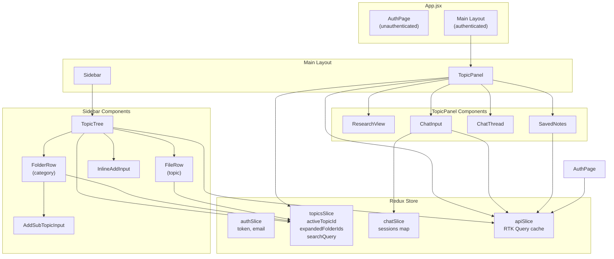
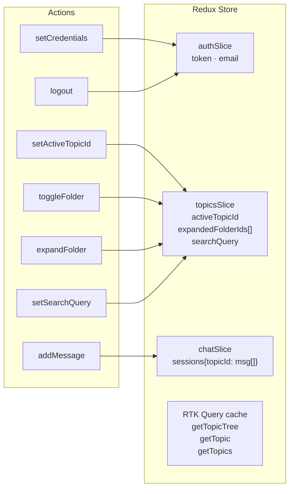
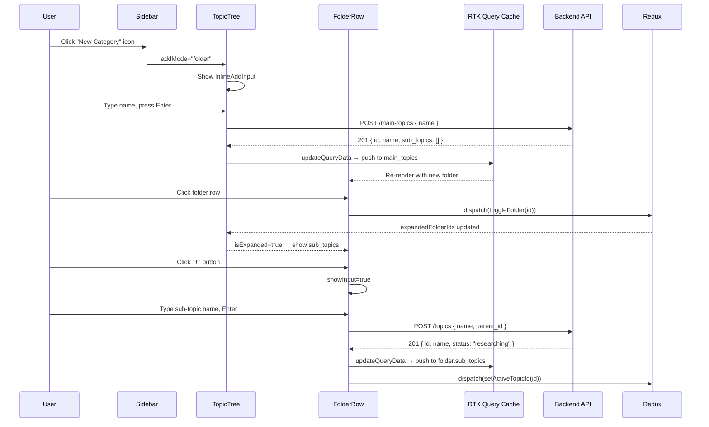
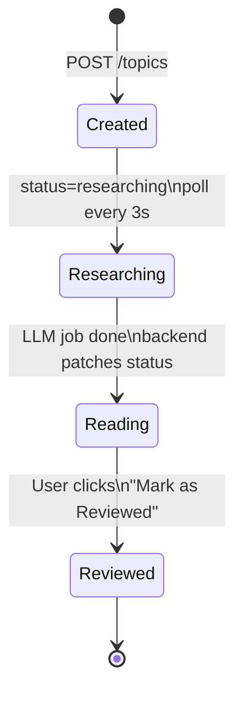
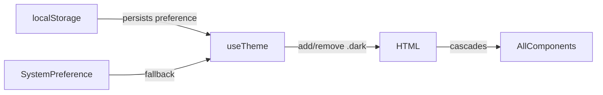

# Frontend Documentation

> React 18 · Vite · Redux Toolkit · RTK Query · Tailwind CSS

---

## Architecture Overview



---

## Project Structure

```
frontend/src/
├── App.jsx                      # Root — auth gate, layout split
├── main.jsx                     # React + Redux provider mount
├── index.css                    # Tailwind directives
├── setupTests.js
│
├── components/
│   ├── AuthPage.jsx             # Login / register / OAuth
│   ├── AuthCallback.jsx         # OAuth redirect handler
│   ├── Sidebar.jsx              # Left panel shell + header actions
│   ├── TopicTree.jsx            # Tree list (categories + root topics)
│   ├── FolderRow.jsx            # Category row (expand/collapse/rename/delete)
│   ├── FileRow.jsx              # Topic row (select/rename/delete/retry)
│   ├── AddSubTopicInput.jsx     # Inline input inside an expanded category
│   ├── TopicPanel.jsx           # Right panel — research + notes + chat
│   ├── ResearchView.jsx         # Renders the 7-field LLM research
│   ├── SavedNotes.jsx           # Saved note cards
│   ├── ChatThread.jsx           # Message list
│   ├── ChatInput.jsx            # Textarea + send button
│   └── shared/
│       ├── StatusBadge.jsx      # researching / reading / reviewed pill
│       └── ConfirmDialog.jsx    # Themed modal replacing window.confirm
│
├── hooks/
│   └── useTheme.js              # Dark/light mode — reads/writes localStorage + system pref
│
├── services/
│   └── api.js                   # RTK Query API slice + all endpoints
│
├── store/
│   ├── index.js                 # Redux store setup
│   ├── authSlice.js             # Auth state + localStorage persistence
│   ├── topicsSlice.js           # UI state: active topic, expanded folders, search
│   └── chatSlice.js             # Per-topic chat message sessions
│
└── tests/
    └── properties.test.js
```

---

## State Management



### Cache strategy

The `getTopicTree` result is the single source of truth for the sidebar. Every mutation patches the cache in-place via `updateQueryData` instead of refetching the full tree:

| Mutation | Cache operation |
|----------|----------------|
| `createTopic` | Append item to `root_topics` or folder's `sub_topics` |
| `createMainTopic` | Append folder to `main_topics` |
| `renameTopic` | Find + mutate name in tree + individual topic cache |
| `renameMainTopic` | Find + mutate folder name in tree |
| `updateTopicStatus` | Find + mutate status in tree + individual topic cache |
| `deleteTopic` | Filter out from `root_topics` and all `sub_topics` |
| `deleteMainTopic` | Filter out from `main_topics` |
| `retryResearch` | Set status to `researching` in tree |

`GET /topic-tree` is called **once** on load. The only time it's called again is on hard refresh or session start.

---

## Component Interactions



---

## Polling Strategy

Research generation is async on the backend. The frontend polls `GET /topics/:id` to detect when it completes:



- `TopicPanel` polls `GET /topics/:id` every 3 seconds **only** when `topic.status === 'researching'`
- `TopicTree` polls `GET /topic-tree` every 3 seconds when any topic in the tree has `status === 'researching'`, stops when all are done
- When status transitions from `researching` → `reading`, the panel patches the tree cache directly so the sidebar badge updates without a tree refetch

---

## Theme System

Uses Tailwind's `darkMode: 'class'` strategy. `useTheme` hook adds/removes the `dark` class on `<html>`:



All components use paired Tailwind classes: `bg-white dark:bg-gray-900`, `text-gray-900 dark:text-gray-100`, etc.

---

## Brand Color System

Custom `brand` palette defined in `tailwind.config.js` — warm violet-purple, not the default Tailwind blue:

| Token | Hex | Used for |
|-------|-----|----------|
| `brand-500` | `#8b5cf6` | Buttons, active border, user chat bubble, send button |
| `brand-600` | `#7c3aed` | Hover state |
| `brand-50` | `#f5f3ff` | Active item background (light mode) |
| `brand-900/20` | — | Active item background (dark mode) |
| `brand-400` | `#a78bfa` | Focus rings |

---

## Key Files Reference

### `api.js` — all backend communication

Every API call goes through the RTK Query `apiSlice`. Mutations use `onQueryStarted` + `updateQueryData` for immediate optimistic updates with automatic rollback on failure.

### `topicsSlice.js` — sidebar UI state

```js
{
  searchQuery: '',        // live search filter
  activeTopicId: null,    // which topic is open in the panel
  expandedFolderIds: [],  // which categories are expanded
}
```

`expandedFolderIds` is converted to a `Set` in `TopicTree` for O(1) lookups.

### `chatSlice.js` — ephemeral chat sessions

Chat messages are stored in Redux only — they are **not persisted** to the backend. Refreshing the page clears the chat. Saved notes are persisted via `POST /topics/:id/notes`.

---

## Local Setup

```bash
cd frontend
npm install
cp .env.example .env        # set VITE_API_BASE_URL=http://localhost:8000
npm run dev                 # http://localhost:5173
```

### Environment variables

| Variable | Description |
|----------|-------------|
| `VITE_API_BASE_URL` | Backend base URL (default: `http://localhost:8000`) |

### Build

```bash
npm run build    # outputs to dist/
npm run preview  # preview the production build locally
```

---
